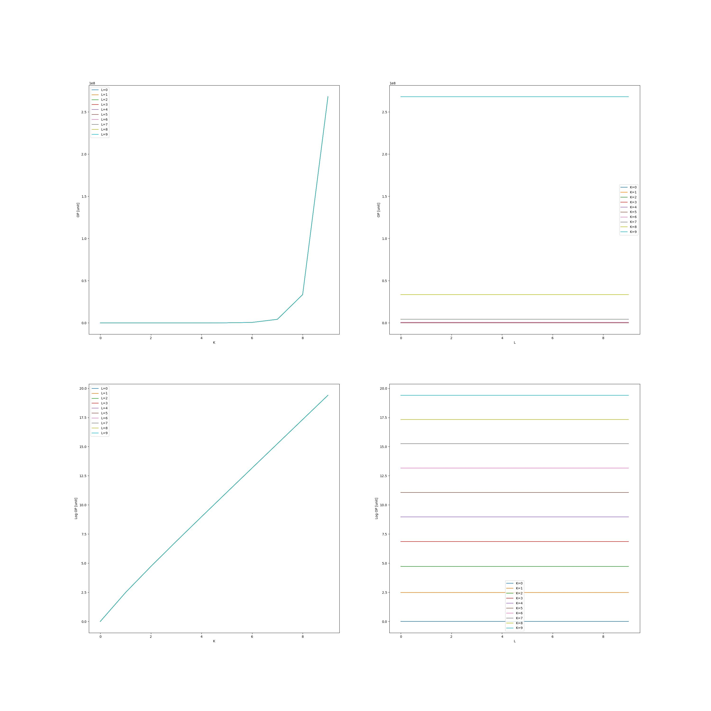

<h1 align="center"> MNOŻENIE MACIERZY </h1>
 <h3 align="center">
 Filip Twardy 
 Jakub Myśliwiec
</h3>

#### Zadanie
Dla macierzy o rozmiarze mniejszym lub równym $2^l × 2^l$
algorytm tradycyjny. Dla macierzy o rozmiarze większym od
$2^l × 2^l$ algorytm rekurencyjny Binéta.

## Algorytm rekurencyjny

Pseudokod naszej implementacji algorytmu rekurencyjnego.

```
    mul(A, B, C, l):
        size <- rozmiar macierzy A, B, C
        if  size <= l :
            for i < size
                for j < size
                    for k < size
                        C[i][j] += A[i][k]*B[k][j]
        else 
            A11, A12, A21, A22 -> 4 bloki macierzy A
            B11, B12, B21, B22 -> 4 bloki macierzy B
            C11, C12, C21, C22 -> 4 bloki macierzy C
            mul(A11, B11, C11)
            mul(A12, B21, C11)
            mul(A11, B12, C12)
            mul(A12, B22, C12)
            mul(A21, B11, C21)
            mul(A22, B21, C21)
            mul(A21, B12, C22)
            mul(A22, B22, C22)      
        
```

Nasza funkcja przyjmuję na wejście cztery argumenty:
* Macierz wejściową A
* Macierz wejściową B
* Macierz wynikową C do której będzie zapisywać wyniki mnożenia
* parametr l świadczący o tym w którym momencie rozpocząć wykonywanie 
algorytmu metodą klasyczną


### Wykres czasu wykonania od wielkości macierzy dla rónych wartości parametru l


Dla większych macierzy (k>=8) można zauważyć że algorytm Bineta pozwala przyśpieszyć działanie algorytmy. Programy z mniejszym parametrem l, wykonują się szybciej. Jest to spowodowane tym, że w tych wypadkach tylko najmniejsze macierze liczone są algorytmem klasycznym co pozwala przyśpieszyć mnożenie.
### Wykres liczby operacji zmiennoprzecinkowych od wielkości macierzy dla rónych wartości parametru l



Jak widać niezależnie od parametru l liczba operacji zmiennoprzecinkowych jest niezmienna. Jest ona natomiast liniowo proporcjonalna do wielkości macierzy.

### Wnioski

Algorytm rekurencyjny Bineta pozwala w pewnym stopniu przyśpieszyć mnożenie macierzy. Przyśpieszenie jest tym bardziej widoczne czym większa jest macierz. Dodatkowo algorytm ten pozwala w teorii mnożyć bloki macierzy równolegle co pozwoliło by na jeszcze większy wzrost przyśpieszenia czasu mnożenia macierzy.