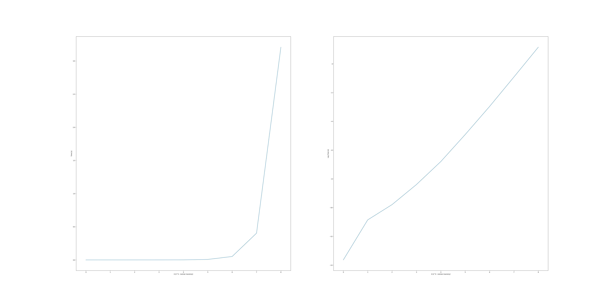
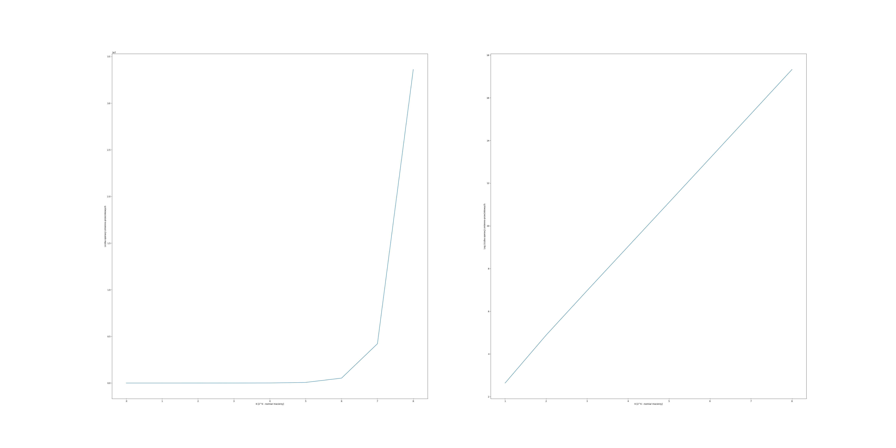

<h1 align="center"> ODWRACANIE MACIERZY </h1>
 <h3 align="center">
 Filip Twardy 
 Jakub Myśliwiec
</h3>

#### Zadanie
Proszę zaimplementować rekurencyjne odwracanie macierzy o
rozmiarze 2^k × 2^k wykorzystując rekurencyjne mnożenie
macierzy

## Algorytm rekurencyjny

Nasz algorytm skłądał się z kilku kroków:

inverse(A):

1. Podziel macierz wejściową A na cztery bloki:
```
     | A11 A12 |
A =  |         |
     | A21 A22 | 
```
2. Oblicz macierz odwrotną dla `A11`

```
A11_inverse = inverse(A11)
```

3. Oblicz `Dopełnienie Schura`

```
S22 = A22 - A21 * A11_inverse * A12
```

4. Oblicz macierz odwrotną dla S22:
```
S22_inverse = inverse(S22)
```

5. Oblicz wynikowe bloki:

```
B11 = A11_inverse + A11_inverse * A12 * S22_inverse * A21 * A11_inverse
B12 = - A11_inverse * A12 * S22_inverse
B21 = - S22_inverse * A21 * A11_inverse
B22 = S22_inverse
```

6. Złóż wynikową macierz z obliczonych bloków:

```
    | B11 B12 |
B = |         |
    | B21 B22 |
```

## Algorytm mnożenia macierzy

Do mnożenia macierzy użyliśmy algorytmu zaimplementowanego podczas ostatniego zadania:

```
    mul(A, B, C, l):
        size <- rozmiar macierzy A, B, C
        if  size <= l :
            for i < size
                for j < size
                    for k < size
                        C[i][j] += A[i][k]*B[k][j]
        else 
            A11, A12, A21, A22 -> 4 bloki macierzy A
            B11, B12, B21, B22 -> 4 bloki macierzy B
            C11, C12, C21, C22 -> 4 bloki macierzy C
            mul(A11, B11, C11)
            mul(A12, B21, C11)
            mul(A11, B12, C12)
            mul(A12, B22, C12)
            mul(A21, B11, C21)
            mul(A22, B21, C21)
            mul(A21, B12, C22)
            mul(A22, B22, C22)      
        
```

Nasza funkcja przyjmuję na wejście cztery argumenty:
* Macierz wejściową A
* Macierz wejściową B
* Macierz wynikową C do której będzie zapisywać wyniki mnożenia
* parametr l świadczący o tym w którym momencie rozpocząć wykonywanie 
algorytmu metodą klasyczną


### Parametr l

Po przeprowadzeniu testów dobraliśmy parametr l, tak by mnożenie było jak najbardziej optymalne.
W naszym przypadku najlepsze wyniki dobraliśmy dla parametru `l = 4`


### Wykres czasu wykonania od wielkości macierzy



Jak można zauważyć algorytm rekurencyjnego odwracania macierzy ma złożoność wykładniczą - czas wykonania rośnie wykładniczo wraz
ze wzrostem rozmiaru macierzu, co widać na wykresie zlogarytmowanym. 

### Wykres liczby operacji zmiennoprzecinkowych od wielkości macierzy



Wykres ten potwierdza nasze założenia odnośnie złożoności algorytmu i jest zgodny z wykresem czasu.

### Wnioski

Algorytm rekurencyjnego odwracania macierzy pozwala efektywnie obliczyć macierz odwrotną. Ma on jednak pewne wady.
Jako, że algorytm składa się z rekurencyjnego wywołania znalezienia macierzy odwrotnej dla bloków macierzy wejściowej, nie działa on jeśli jeden z tych bloków jest macierzą nieodwracalną. W takim wypadku, nawet jeśli cała macierz jest macierzą
odwracalną, algorytm nie zwróci poprawnego rozwiązania.
