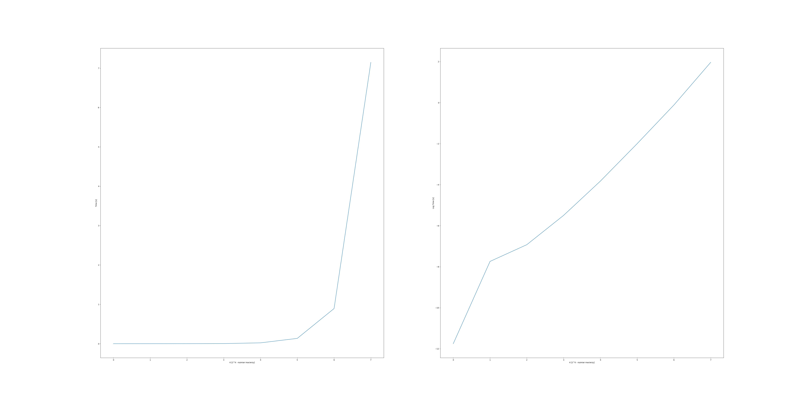

<h1 align="center"> LU Faktoryzacja </h1>
 <h3 align="center">
 Filip Twardy 
 Jakub Myśliwiec
</h3>

#### Zadanie
Proszę zaimplementować rekurencyjną LU faktoryzacje macierzy o
rozmiarze 2^k × 2^k wykorzystując rekurencyjne mnożenie
macierzy oraz rekurencyjne odwracanie macierzy

## Algorytm LU faktoryzacji

Nasz algorytm skłąda się z nastepujących kroków:

1. Podziel macierz wejściową A na cztery bloki:
```
     | A11 A12 |
A =  |         |
     | A21 A22 | 
```
2. Rekurencyjnie wywołuj faktoryzacje LU dla lewej górnej macierzy
```
L11, U11 = lu_factorization(A11)
```
3. Oblicz macierz odwrotną do L11 oraz U11
```
L11_inv = inverse(L11)
U11_inv = inverse(U11)
```
4. Oblicz L21, oraz U12
```
L21 = mul(A21, U11_inv)
U12 = mul(L11_inv, A12)
```
5. Obliczamy macierz S
```
S = A22 - mul(A21, mul(A11_inv, A12))
```
6. Obliczamy L22 i U22\
```
L22, U22 = lu_factorization(S)
```
7. Z powstałych kawałków L11, L21, L22 i U11, U12, U22 tworzymy wynikowe macierze L i U
```
     | L11  0  |
L =  |         |
     | L21 U22 | 
     | U11 U12 |
U =  |         |
     |  0  U22 | 
```

## Algorytm odwracania macierzy

Nasz algorytm skłądał się z kilku kroków:

inverse(A):

1. Podziel macierz wejściową A na cztery bloki:
```
     | A11 A12 |
A =  |         |
     | A21 A22 | 
```
2. Oblicz macierz odwrotną dla `A11`

```
A11_inverse = inverse(A11)
```

3. Oblicz `Dopełnienie Schura`

```
S22 = A22 - A21 * A11_inverse * A12
```

4. Oblicz macierz odwrotną dla S22:
```
S22_inverse = inverse(S22)
```

5. Oblicz wynikowe bloki:

```
B11 = A11_inverse + A11_inverse * A12 * S22_inverse * A21 * A11_inverse
B12 = - A11_inverse * A12 * S22_inverse
B21 = - S22_inverse * A21 * A11_inverse
B22 = S22_inverse
```

6. Złóż wynikową macierz z obliczonych bloków:

```
    | B11 B12 |
B = |         |
    | B21 B22 |
```

## Algorytm mnożenia macierzy

Do mnożenia macierzy użyliśmy algorytmu zaimplementowanego podczas ostatniego zadania:

```
    mul(A, B, C, l):
        size <- rozmiar macierzy A, B, C
        if  size <= l :
            for i < size
                for j < size
                    for k < size
                        C[i][j] += A[i][k]*B[k][j]
        else 
            A11, A12, A21, A22 -> 4 bloki macierzy A
            B11, B12, B21, B22 -> 4 bloki macierzy B
            C11, C12, C21, C22 -> 4 bloki macierzy C
            mul(A11, B11, C11)
            mul(A12, B21, C11)
            mul(A11, B12, C12)
            mul(A12, B22, C12)
            mul(A21, B11, C21)
            mul(A22, B21, C21)
            mul(A21, B12, C22)
            mul(A22, B22, C22)      
        
```

Nasza funkcja przyjmuję na wejście cztery argumenty:
* Macierz wejściową A
* Macierz wejściową B
* Macierz wynikową C do której będzie zapisywać wyniki mnożenia
* parametr l świadczący o tym w którym momencie rozpocząć wykonywanie 
algorytmu metodą klasyczną


### Parametr l

Po przeprowadzeniu testów dobraliśmy parametr l, tak by mnożenie było jak najbardziej optymalne.
W naszym przypadku najlepsze wyniki dobraliśmy dla parametru `l = 4`


### Wykres czasu wykonania od wielkości macierzy



Jak można zauważyć algorytm rekurencyjnej faktoryzacji LU macierzy ma złożoność wykładniczą - czas wykonania rośnie wykładniczo wraz
ze wzrostem rozmiaru macierzu, co widać na wykresie zlogarytmowanym. 

### Wykres liczby operacji zmiennoprzecinkowych od wielkości macierzy


Wykres ten potwierdza nasze założenia odnośnie złożoności algorytmu i jest zgodny z wykresem czasu.

### Wnioski

Algorytm rekurencyjnej faktoryzacji LU macierzy pozwala efektywnie obliczyć tę dekompozycję. Ma on jednak pewne wady.
Po pierwsze niektóre fragmenty macierzy oraz sama macierz nie mogą być osobliwe ponieważ wykonujemy operacje *inverse*, która wymaga nieosobliwości macierz.
Jest to ten sam problem jaki powstawał przy implementacji algorytmu odwaracnia macierzy.
